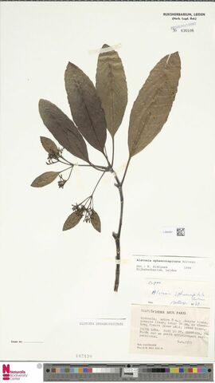
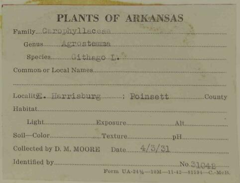

# Digi-Leap
Extract information from images of herbarium specimen labels. To do this we need to convert labels on the images into text using optical character recognition (OCR) and then extract information form the text using natural language processing (NLP). There are other steps in between to make these larger goals possible.

Given an image like:

We want to:
1. [Find all the labels on the image.](#Find-Labels)
   1. [Cutout and clean up the labels so that we can OCR them.](#Clean-Labels)
1. [OCR the cleaned up label images.](#OCR-Labels)
   1. [Cleanup the OCR text so that we can run NLP on it.](#Clean-OCR-Text)
1. [Use NLP to extract information from the clean OCR text.](#Extract-Information)

We are going to treat this as a pipeline of Machine Learning (ML) models with swappable steps. This means that each step may be independently trained and implemented so that appropriate models may be used for any particular dataset. A general strategy for the pipeline is to use, as much as possible, existing open source libraries for each step and keep the computing requirements low enough so that everything can be run on a "moderately sized" desktop. I am currently developing this using a laptop that has 32 GB of memory, an 8 GB GPU, and a 4 GHz CPU that can run 12 processes.

## Find Labels

#### Get images

In production, providers will upload the herbarium sheets of interest. However, for model training we will download properly licensed labels for training the models ourselves.

#### What is a label?

We are currently considering a label as a separate piece of paper affixed to the herbarium sheet. So the stamp in the upper right corner or at the center near the bottom are not considered labels. We are also excluding rulers and color guides like the one at the bottom of the image. Other things not considered labels are envelopes containing plant parts, and any tags attached by string to the specimen. In this image, the labels are clustered at the bottom right and include typewritten labels, handwritten labels, barcodes, and a QR-code.

Labels will be roughly aligned to the edges of the herbarium sheet itself.

#### Model training for finding labels

The strategy we are using for training this model is to download some herbarium sheets and have volunteers (citizen scientists) identify where the labels are on the sheet and what type of writing is on them. We are using [Notes from Nature](https://www.zooniverse.org/organizations/md68135/notes-from-nature) to organize the data collection. Notes from Nature is a part of the [Zooniverse](https://www.zooniverse.org/).

We use [download_images.py](download_images.py) (**TODO rewrite this script**) to download images for Notes from Nature "expeditions".

### Clean Labels

OCR engines are sensitive to noise, so we need to clean up the labels before we OCR them. Noise can be anything from stray marks and smudges, to underlined fields on the form that indicate where the field data should go, to rotated text.

See below for a label with underlines that will confound OCR engines.

## OCR Labels

- Train OCR engine for our uses.
- Adjust the set of OCR engine parameters.

### Clean OCR Text

OCR output is often dirty itself. There are spaces inside of words, and the engine may mistake one character for another. We need to clean up the text before performing Information Extraction (IE) on it.

## Extract Information

This is a project unto itself and is in another repository.
