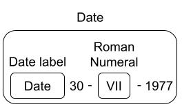

# Parsing Herbarium Label Text

Here we describe a novel method for parsing herbarium label text that combines a FloraTraiter (FloraTraiter) with a large language model (ChatGPT4).

The task is take text like this:
```
Herbarium of
San Diego State College
Erysimum capitatum (Dougl.) Greene.
Growing on bank beside Calif. Riding and
Hiking Trail north of Descanso.
13 May 1967 San Diego Co., Calif.
Coll: R.M. Beauchamp No. 484
```
And convert it into a machine-readable format like:
```json
{
    "dwc:eventDate": "1967-05-13",
    "dwc:verbatimEventDate": "13 May 1967",
    "dwc:country": "United States",
    "dwc:stateProvince": "California",
    "dwc:county": "San Diego",
    "dwc:recordNumber": "484",
    "dwc:verbatimLocality": "Bank beside California, Riding and Hiking Trail north of Descanso",
    "dwc:recordedBy": "R.M. Beauchamp",
    "dwc:scientificNameAuthorship": "Dougl Greene",
    "dwc:scientificName": "Erysimum capitatum (Dougl.) Greene",
    "dwc:taxonRank": "species"
}
```
Of course, the OCRed input text and the resulting JSON are not always this clean.

## Major processing steps

1. Given a text file with OCRed label text.
2. Use FloraTraiter to get one version of JSON output.
3. Use ChatGPT4 to parse the label.
4. Clean the ChatGPT4 output to get a second version of the JSON output.
5. Use heuristics to merge the two outputs into a single "best" JSON output.

### OCR input

For this process it is a given and label text from any source will do. Our programs require that the input text for each label is in its own text file.

We developed a pipeline that finds labels on herbarium sheets and uses an ensemble of image processing techniques and OCR engines to pull high quality text from herbarium labels. See [reference ourselves].

### Rule-based parsing (FloraTraiter)

We use a multistep approach to parse text into traits. The rules themselves are written using spaCy rules with enhancements we developed to streamline the process. The process is outlined below:

1. Have experts identify relevant terms and target traits.
2. We use expert identified terms to label terms using spaCy's phrase matchers. These are sometimes traits themselves but are more often used as anchors for more complex patterns of traits.
3. We then build up more complex terms from simpler terms using spaCy's rule-based matchers repeatedly until there is a recognizable trait. See the image below.
4. We may then link traits to each other (entity relationships) using also spaCy rules.
   1. Typically, a trait gets linked to a higher level entity like SPECIES <--- FLOWER <--- {COLOR, SIZE, etc.} and not peer to peer like PERSON <---> ORG.

As a simple example, a label has a date given as `Date 30-VII-1977` which is correctly parsed as `1977-07-30`. The process looks like:

- First the base terms are recognized a "date label" and a "roman numeral".
- Then a rule that says to match a "date label" followed by a "number", then a "dash/slash", a "roman numeral", a "dash/slash", followed by another "number" yields a date.
- If the date does not have another identifier like "date determined" the date defaults to "event date".

[](date_parsing.jpg)

The rules can become complex and the vocabularies for things like taxa, or a gazetteer can be huge, but you should get the idea of what is involved in label parsing.

This parser was originally developed to parse plant treatments and was later adapted to parse label text. As such, it does have some issues with parsing label text. When dealing with treatments the identification of traits/terms is fairly easy and the linking of traits to their proper plant part is only slightly more difficult.

With labels, both the recognition of terms and linking them is difficult. There is often an elision of terms, museums or collectors may have their own abbreviations, and there is an inconsistent formatting of labels. Rule based-parsers are best at terms like dates, elevations, and latitudes/longitudes where the terms have recognizable "shapes" like numbers followed by units with a possible label. They are weakest is with vague terms like habitat, locality, or names.

For dynamic properties the rule-base parser does significantly better with treatment than labels. One of the biggest issues of rule-base parsers on labels is false positives for some dynamic property terms. For instance, it will sometimes mistake route numbers like "Rt. 12" for a count. This can be counteracted by adding more rules that bar a count when it is preceded by a route abbreviation. However, this correction process requires careful attention to the causes of FloraTraiter's failures and an expert to correct them.

In short, rule-base parsers can have excellent accuracy and precision, they will not hallucinate data, and they are also easily tweaked. However, the cost is a huge amount of effort by an expert that understands the problem domain and the parser enough to correct the parsing problems.

### Large language model (LLM) parsing

In contrast to rule-based parsing, large language models like ChatGPT require very little knowledge of how they work and most of the upfront effort is with "prompt engineering". Prompt engineering is shaping your queries to the LLM so that they yield the best results possible; an art form in itself. Our approach to prompt engineering was to keep the prompts small and focused on extracting information in Darwin Core format. The prompt that we used for this paper was "Extract all information from the herbarium label text and put the output into JSON format using DarwinCore fields including dynamicProperties" followed by the label text. This is a small prompt, but it worked reasonably well.

ChatGPT did best with the vague terms like habitat, locality, and names where FloraTraiter did worse. Surprisingly, ChatGPT did worse at the fields have a defined structure to them. Exactly the ones where the rule-base parser did best.

ChatGPT performed abysmally with dynamic properties. So poorly, we have excluded dynamic properties from comparing to FloraTraiter and final reconciliation.

Even at its best ChatGPT had issues:

- Hallucination of Darwin Core terms.
  - Out of 2128 labels fed to ChatGPT it extracted 420 labels, of which 155 were valid, and 265 were hallucinated. Note that this is after performing a term cleanup pass on the data.
  - Examples: "gbif:identificationRemarks", "QF".
  - Some hallucinated labels are usable and others are not.
- Hallucination of field data vs. Darwin Core term was uncommon. It occurred mostly when there was very little text in the label.
- The returned JSON output was often improperly formatted.
- Adding extra text "explaining" the output around the data.
  - These kinds of "explanations" can go on for paragraphs: `Please note that you have to use the correct Darwin Core (DWC) standards' terms according to your preference.`
- Putting nested JSON data inside a Darwin Core field.
  - For instance: `"dwc:eventDate": {"eventDate":"1980-06-01"},`.
- Mixing up field data as if the labels were switched.
- There are other errors that are specific to the Darwin Core label.

Despite all of this, there is plenty of data that can be mined from the ChatGPT output, you just shouldn't use it without checks.

### Reconciliation of rule-based and large language parser models

In an effort to get the best of the...
