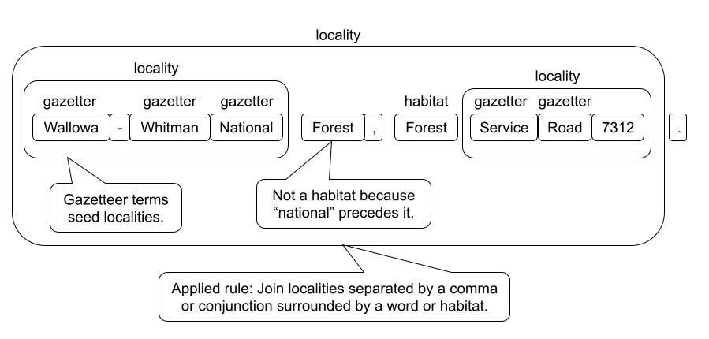

# Parsing Herbarium Label Text

Here we describe a novel method for parsing herbarium label text that combines a FloraTraiter (FloraTraiter) with a large language model (ChatGPT4).

The task is take text like this:
```
Herbarium of
San Diego State College
Erysimum capitatum (Dougl.) Greene.
Growing on bank beside Calif. Riding and
Hiking Trail north of Descanso.
13 May 1967 San Diego Co., Calif.
Coll: R.M. Beauchamp No. 484
```
And convert it into a machine-readable Darwin Core format like:
```json
{
    "dwc:eventDate": "1967-05-13",
    "dwc:verbatimEventDate": "13 May 1967",
    "dwc:country": "United States",
    "dwc:stateProvince": "California",
    "dwc:county": "San Diego",
    "dwc:recordNumber": "484",
    "dwc:verbatimLocality": "Bank beside California, Riding and Hiking Trail north of Descanso",
    "dwc:recordedBy": "R.M. Beauchamp",
    "dwc:scientificNameAuthorship": "Dougl Greene",
    "dwc:scientificName": "Erysimum capitatum (Dougl.) Greene",
    "dwc:taxonRank": "species"
}
```
Of course, the OCRed input text and the resulting JSON are not always this clean.

## Major processing steps

1. Given a text file with OCRed label text.
2. Use FloraTraiter to get one version of JSON output.
3. Use ChatGPT4 to parse the label.
4. Clean the ChatGPT4 output to get a second version of the JSON output.
5. Use heuristics to merge the two outputs into a single "best" JSON output.

### OCR input

For this process label text given, any any source will do. Our programs do require that the input text for each label is in its own text file.

We developed a pipeline that finds labels on herbarium sheets and uses an ensemble of image processing techniques and OCR engines to pull high quality text from herbarium labels. See [reference ourselves].

### Rule-based parsing (FloraTraiter)

FloraTraiter uses a multistep approach to parse text into traits. The rules themselves are written using spaCy, with enhancements we developed to streamline the rule building process. The general outline of the rule building process follows:

1. Have experts identify relevant terms and target traits.
2. We use expert identified terms to label terms using spaCy's phrase matchers. These are sometimes traits themselves, but are more often used as anchors for more complex patterns of traits.
3. We then build up more complex terms from simpler terms using spaCy's rule-based matchers repeatedly until there is a recognizable trait. See the image below.
4. Depending on the trait we may then link traits to each other (entity relationships) using also spaCy rules.
   1. Typically, a trait gets linked to a higher level entity like SPECIES <--- FLOWER <--- {COLOR, SIZE, etc.} and not peer to peer like PERSON <---> ORG.

As an example of parsing a locality is shown below:

[](locality_parsing.jpg)

The rules can become complex and the vocabularies for things like taxa, or a gazetteer can be huge, but you should get the idea of what is involved in label parsing.

FloraTraiter was originally developed to parse plant treatments and was later adapted to parse label text. As such, it does have some issues with parsing label text. When dealing with treatments the identification of traits/terms is fairly easy and the linking of traits to their proper plant part is only slightly more difficult.

With labels, both the recognition of terms and linking them is difficult. There is often an elision of terms, museums or collectors may have their own abbreviations, and there is an inconsistent formatting of labels. Rule based-parsers are best at terms like dates, elevations, and latitudes/longitudes where the terms have recognizable structures, like numbers followed by units with a possible leading label. They are weakest is with vague terms like habitat, locality, or even names that require some sort of analysis of the context or meaning of the words.

For dynamic properties the FloraTraiter does significantly better with treatment than labels. One of the biggest issues of FloraTraiter on labels is false positives for some dynamic property terms. For instance, it will sometimes mistake route numbers like "Rt. 12" for a count. This can be counteracted by adding more rules that bar a count when it is preceded by a route abbreviation. However, this correction process requires careful attention to the causes of FloraTraiter's failures and an expert to correct them.

When parsing labels FloraTraiter can have excellent precision, and sometimes excellent accuracy, it will not hallucinate data, and it is also easily tweaked. However, the cost is a huge amount of effort by an expert that understands the problem domain and FloraTraiter well enough to correct any parsing problems. The huge effort is caused by the need to write one or often several parsers for every field type and form. For instance, when parsing taxa there are patterns for every commonly used taxon level, and separate parser functions for when there is a binomial or trinomial term verses a monomial term. The taxon authority parer builds on the bi, tri, or monomial term. Which is then fed into a parser that recognizes a binomial taxon followed by an authority which is then followed by a lower level term with its own authority, like, "Neptunia gracilis Muhl. ex Willd. var. varia (Nutt.) Brewer". And, I haven't mentioned the cases when there is more than one taxon written in a single mention like, "Neptunia gracilis & Mimosa sensitiva" or when one species is mentioned in relation to another like, "It resembles M. sensitiva in amplitude". It can get complicated.

### Large language model (LLM) parsing using ChatGPT4

In contrast to rule-based parsers like FloraTraiter, large language models like ChatGPT require very little knowledge of how they work and most of the upfront effort is with "prompt engineering". Prompt engineering is shaping your queries to the LLM so that they yield the best results possible; an art form in itself. Our approach to prompt engineering was to keep the prompts small and focused on extracting information in Darwin Core format. The prompt that we used for this paper was "Extract all information from the herbarium label text and put the output into JSON format using DarwinCore fields including dynamicProperties" followed by the label text. This is a small prompt, but it worked reasonably well.

ChatGPT did best with the vague terms like habitat, locality, and names where FloraTraiter did worse. Surprisingly, ChatGPT did worse at the Darwin Core fields have a defined structure to them. Exactly the ones where the FloraTraiter did best.

ChatGPT performed abysmally with dynamic properties. So poorly, we have excluded dynamic properties from comparing to FloraTraiter and final reconciliation.

Even at its best ChatGPT had issues:

- Hallucination of Darwin Core terms.
  - Out of 2128 herbarium labels fed to ChatGPT it extracted 420 term, of which 155 were valid, and 265 were hallucinated. Note that this is after performing a term cleanup pass on the data.
  - Examples: "gbif:identificationRemarks", "QF".
  - Some hallucinated Darwin Core terms are usable and others are not.
- Hallucination of field data as apposed to Darwin Core terms was uncommon. It occurred mostly when there was very little text in the herbarium label.
- The returned JSON output was often improperly formatted with things like extra commas, improper quoting, and the replacement or addition of extra character.
  - We could remove the JSON formatting constraint but that would require a reformatting of the returned data anyway.
- ChatGPT often adds extra text "explaining" the output around the data.
  - These kinds of "explanations" can go on for paragraphs: `Please note that you have to use the correct Darwin Core (DWC) standards' terms according to your preference.`
- Putting nested JSON data inside a Darwin Core field.
  - For instance: `"dwc:eventDate": {"eventDate":"1980-06-01"},`.
- Mixing up field data as if the Darwin Core labels were switched. Unsurprisingly, this happens most often with fields that humans also mix up like locality and habitat.
- There are other errors that are specific to each Darwin Core label.

Despite all of this, there is plenty of data that can be mined from the ChatGPT output, you just shouldn't use it without data consistency checks or formatting correction.

### Reconciliation of FloraTraiter and ChatGPT

Given that FloraTraiter does better at some Darwin Core terms and ChatGPT is stronger at others the obvious thing to try is to see if we can reconcile the differences relying more on each one where it is strongest. With some exceptions, there is one reconciler per Darwin Core term. Most reconcilers are very simple and a few only pass the data though from either ChatGPT or FloraTraiter. Others are a bit more complex. Each reconciler takes as input, the JSON data from FloraTraiter, JSON data from ChatGPT that was subsequently cleaned, and the original label text that was fed to both. All reconcilers have a list of aliases, hallucinated Darwin Core terms, that map well to the correct term. For example, the hallucinated terms "dwc:locationState", "dwc:state", and "dwc:province" are aliases for "dwc:stateProvince".

As an example of a Darwin Core field with a moderately complex reconciler is "dwc:verbatimLocality". Before going through the process used to reconcile this field there are a few observations to note:
- ChatGPT tends to correctly find the locality more often than FloraTraiter
- But when FloraTraiter finds the correct locality it often finds a longer correct version of the locality.
  - This longer version is often broken up into a list of locality values.
- ChatGPT sometimes puts a separate locality notation under the "dwc:locationRemarks" term.
- ChatGPT's version of locality is sometimes presented as a nested object. That is, it is itself a dictionary of locality related terms.

Here is the process we use to reconcile "dwc:verbatimLocality":
1. Look for the locality in the ChatGPT output listed under any of its aliases.
   1. Do the same for location remarks, using its own aliases.
   2. If ChatGPT's version of locality is a nested object then see if we can pull a good locality from one of its sub-terms. If we can't then use FloraTraiter's version.
2. Look for the locality in FloraTraiter output (no aliases needed).
   1. If it is a list of localities, see if we can extend FloraTraiter's version of locality into a seamless single string. I.e. are all the FloraTraiter locality list values only separated by whitespace? If we can then save this extended version for possible use later.
3. Use ChatGPT's version of locality if it is not empty but FloraTraiter's version it is empty.
4. If current locality is contained in the extended FloraTraiter version then use the FloraTraiter version.
5. Look to see if we can use the ChatGPT's location remarks to either extend the currently used locality or use it as another item in a locality list.
